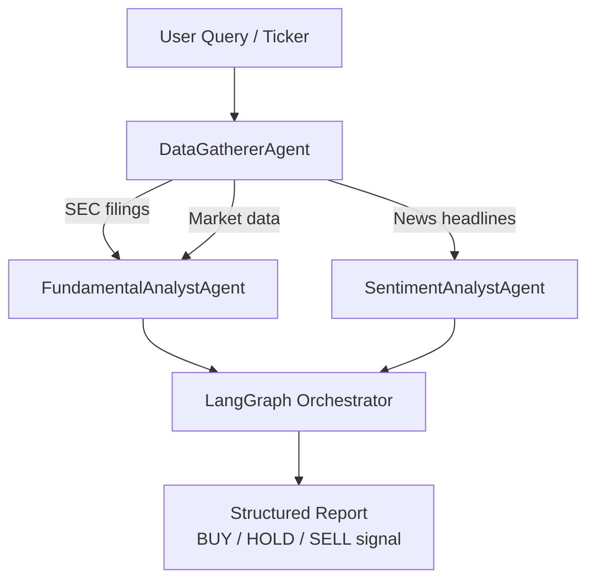

<div align="center">

# Finance Agent Crew

[](https://github.com/shaikn6/finance-agent-crew/actions)
[](https://python.org)
[](https://langchain-ai.github.io/langgraph/)
[](LICENSE)
[](docker-compose.yml)

**Multi-agent LangGraph crew for autonomous financial research — SEC EDGAR scraping, fundamental analysis, and sentiment scoring**

</div>

## Architecture



## Agents

| Agent | Role | Data Sources |
|-------|------|-------------|
| `DataGathererAgent` | Parallel I/O — fetches raw data | SEC EDGAR, Alpha Vantage, News APIs |
| `FundamentalAnalystAgent` | P/E, EPS, revenue trend analysis | 10-K, 10-Q filings |
| `SentimentAnalystAgent` | News sentiment scoring | RSS, NewsAPI |

## Quick Start

```bash
git clone https://github.com/shaikn6/finance-agent-crew
cd finance-agent-crew && cp .env.example .env
# Set ANTHROPIC_API_KEY and ALPHA_VANTAGE_KEY in .env
docker compose up -d
# API: http://localhost:8000/docs
```

## Development

```bash
pip install -e ".[dev]"
pytest tests/ -v --cov=src
ruff check src/ tests/
```

## Example

```python
from src.agents.data_gatherer import DataGathererAgent

agent = DataGathererAgent()
data = await agent.gather("AAPL")
# Returns structured SEC + market + news bundle
```

## License

MIT
